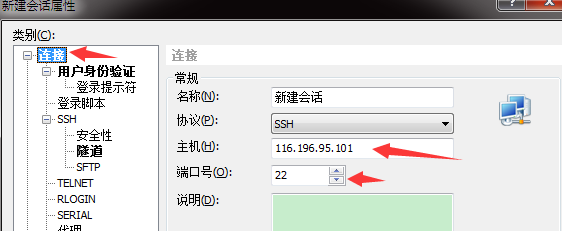
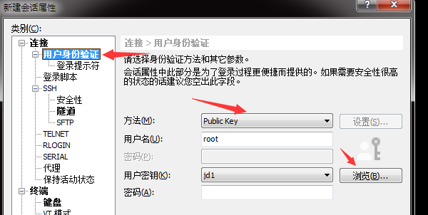
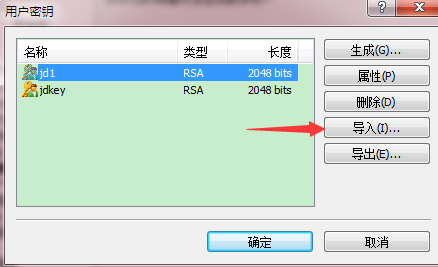

# 一、准备工作：

### 1、确认服务器sshd的配置文件（需要root权限）

```
$ vim /etc/ssh/sshd_config
```

　找到以下内容，并去掉注释符”#“

```
RSAAuthentication yes
PubkeyAuthentication yes
AuthorizedKeysFile      .ssh/authorized_keys
```
###  2、如果修改了配置文件需要重启sshd服务 （需要root权限）
```
$ /sbin/service sshd restart
```

# 二、配置SSH无密码登录需要3步：

### 1.生成公钥和私钥

注意, 在windows或者其它系统本机生成密钥对

对于windows的Administrator账户, `~/.ssh`就是`C:\Users\Administrator\.ssh`目录 

```
cd ~/.ssh
$ ssh-keygen -t rsa
```

```
Generating public/private rsa key pair.
Enter file in which to save the key (/c/Users/Administrator/.ssh/id_rsa): jd1
Enter passphrase (empty for no passphrase):
Enter same passphrase again:
Your identification has been saved in jd_try.
Your public key has been saved in jd_try.pub.
The key fingerprint is:
SHA256:WKSfNS7NcHpvJtYyVoTfNBQ7z+Sycn42RmH7Jt5oo/k Administrator@A-2016052402
The key's randomart image is:
+---[RSA 2048]----+
|        .     o. |
|       o   . . . |
|      . o = . = .|
|       + X + o X |
|      . S = o + *|
|         o +   = |
|          * * + .|
|         o * =+==|
|            o=E*o|
+----[SHA256]-----+
```


### 2.导入公钥到认证文件,更改权限

把公钥传到服务器(在本机运行)

```
scp jd1.pub root@116.196.95.101:/root/.ssh/
```

在服务器端

```
cd /root/.ssh
cat jd1.pub >> authorized_keys
chmod 600 *
```

### 3.测试

#### 1.使用xShell测试




注意导入的时候选的是```私钥```



#### 2.使用mingw 命令行测试

编辑`~/.ssh/config` 文件

如果是Administrator,文件路径是`C:\Users\Administrator\.ssh\config`

文件内容 

```
Host 	116.196.95.101
IdentityFile ~/.ssh/jd1 
```

下面指示了可以指定服务器端口

	Host g.mll3321.com
	IdentityFile ~/.ssh/mll
	Port 1121
	User dengjun
以后使用scp传文件就不需要输入密码了

